<div align="center">

# 🛍️ Shoppers Stop

**A full-stack microservices e-commerce platform**

[](https://shoppers-stop.duckdns.org)
[](https://openjdk.org/)
[](https://spring.io/projects/spring-boot)
[](https://react.dev/)
[](https://www.docker.com/)
[](https://aws.amazon.com/)

</div>

---

## 📋 Overview

Shoppers Stop is a production-grade e-commerce application built with a **microservices architecture**. It features role-based access (Buyer/Seller), JWT authentication, AES-256-GCM password encryption, and full observability with Prometheus & Grafana — all containerized with Docker and deployed on AWS.

### ✨ Key Features

| Feature | Description |
|---|---|
| 🏗️ **Microservices** | Independent services for Users, Products, and Carts with separate databases |
| 🔐 **JWT Authentication** | Stateless auth with role-based access control (Buyer / Seller) |
| 🔒 **AES-256-GCM Encryption** | Client-side password encryption before transit over HTTPS |
| 📊 **Monitoring** | Prometheus metrics + Grafana dashboards for all services |
| 🌐 **HTTPS** | Nginx reverse proxy with Let's Encrypt SSL certificates |
| 🐳 **Containerized** | Multi-stage Docker builds, Docker Hub registry, Docker Compose orchestration |
| ☁️ **AWS Deployed** | EC2 for compute, RDS PostgreSQL for managed databases |
| 🎨 **Premium UI** | Dark-theme React SPA with animations, responsive design, and glassmorphism |

---

## 🏛️ Architecture

```mermaid
graph TB
    subgraph Client
        Browser["🌐 Browser"]
    end

    subgraph AWS_EC2["AWS EC2 Instance"]
        subgraph Docker["Docker Compose"]
            Nginx["🔒 Nginx<br/>SSL Termination<br/>Port 443"]

            subgraph Frontend
                UI["⚛️ shopper-ui<br/>React 18 + Vite<br/>Nginx :80"]
            end

            subgraph Backend["Backend Microservices"]
                Users["👤 user-service<br/>Spring Boot :8082"]
                Products["📦 product-service<br/>Spring Boot :8081"]
                Carts["🛒 cart-service<br/>Spring Boot :8080"]
            end

            subgraph Monitoring
                Prometheus["📈 Prometheus"]
                Grafana["📊 Grafana"]
            end
        end
    end

    subgraph AWS_RDS["AWS RDS"]
        UsersDB[("👤 users_db")]
        ProductsDB[("📦 products_db")]
        CartsDB[("🛒 carts_db")]
    end

    Browser -- "HTTPS :443" --> Nginx
    Nginx -- "/" --> UI
    Nginx -- "/grafana/" --> Grafana
    UI -- "/api/auth/*" --> Users
    UI -- "/api/v1/products/*" --> Products
    UI -- "/api/v1/carts/*" --> Carts
    Users --> UsersDB
    Products --> ProductsDB
    Carts --> CartsDB
    Carts -- "GET product price" --> Products
    Prometheus -- "scrape /actuator/prometheus" --> Users
    Prometheus -- "scrape /actuator/prometheus" --> Products
    Prometheus -- "scrape /actuator/prometheus" --> Carts
    Grafana --> Prometheus

    classDef service fill:#1e1b4b,stroke:#6366f1,stroke-width:2px,color:#e0e7ff
    classDef db fill:#1a1a2e,stroke:#22d3ee,stroke-width:2px,color:#cffafe
    classDef proxy fill:#1a1a2e,stroke:#f59e0b,stroke-width:2px,color:#fef3c7
    classDef monitor fill:#1a1a2e,stroke:#10b981,stroke-width:2px,color:#d1fae5

    class Users,Products,Carts,UI service
    class UsersDB,ProductsDB,CartsDB db
    class Nginx proxy
    class Prometheus,Grafana monitor
```



### Request Flow

```
Browser → Nginx (SSL) → shopper-ui (Nginx) → React SPA
                                            ↘ /api/auth/*       → user-service   → RDS (users_db)
                                            ↘ /api/v1/products/* → product-service → RDS (products_db)
                                            ↘ /api/v1/carts/*    → cart-service    → RDS (carts_db)
```

---

## 🛠️ Tech Stack

| Layer | Technology |
|---|---|
| **Frontend** | React 18, Vite 5, React Router v6, Vanilla CSS |
| **Backend** | Java 21, Spring Boot 3, Spring Security, Spring Data JPA |
| **Database** | PostgreSQL 16 (local containers / AWS RDS prod) |
| **Auth** | JWT (HMAC-SHA256), AES-256-GCM password encryption |
| **API Docs** | OpenAPI 3 / Swagger UI (`/swagger-ui.html`) |
| **ORM** | Hibernate + MapStruct (DTO mapping) + Lombok |
| **Containerization** | Docker (multi-stage builds), Docker Compose |
| **Reverse Proxy** | Nginx (SSL termination + API routing) |
| **Monitoring** | Prometheus + Grafana |
| **Cloud** | AWS EC2 (t2.micro — free tier), AWS RDS PostgreSQL |
| **CI/CD** | PowerShell build script → Docker Hub → EC2 deploy script |
| **DNS** | DuckDNS (free dynamic DNS) |
| **TLS** | Let's Encrypt (auto-renewable certificates) |

---

## 🏆 Engineering Best Practices (Industry Standards)

To ensure this application meets enterprise and production standards, it strictly adheres to the following principles:

1. **Database Migrations (Flyway/Liquibase):** Infrastructure as Code (IaC) for databases. Every schema change is version-controlled via SQL scripts (e.g., `V1__init_cart_schema.sql`). This prevents schema drift across environments and makes database setups reproducible.
2. **Constructor-Based Dependency Injection:** Field injection (`@Autowired`) is completely avoided. Dependencies are injected via final fields in the constructor. This guarantees immutability, prevents `NullPointerException`s, and simplifies mocking during unit testing.
3. **Strict Transaction Management (`@Transactional`):** All database mutation operations (e.g., adding to cart, checkout flow) are strictly wrapped in Spring's `@Transactional` boundaries to ensure ACID compliance and prevent partial commits on failure.
4. **Comprehensive Documentation:** Full OpenAPI 3 (Swagger UI) integration for clear API contracts, alongside an in-depth README mapping out the microservices architecture, data flow, and deployment instructions.

---

## 📂 Project Structure

```
Shoppers/
├── shopper-ui/                 # React frontend (Vite)
│   ├── src/
│   │   ├── api/                # API clients (auth, cart, product, crypto)
│   │   ├── components/         # Reusable UI components
│   │   ├── context/            # React context (AuthContext)
│   │   └── pages/              # Page components (Products, Cart, Checkout, etc.)
│   ├── nginx.conf              # Internal Nginx config (API proxying)
│   └── Dockerfile              # Multi-stage: build + nginx
│
├── java-maven/                 # Backend microservices
│   ├── users/                  # User service (auth, registration, JWT)
│   │   ├── src/main/java/com/example/users/
│   │   │   ├── config/         # Security, JWT, AES decryption
│   │   │   ├── controller/     # AuthController, UserController
│   │   │   ├── entity/         # User entity
│   │   │   └── service/        # UserService
│   │   └── Dockerfile
│   │
│   ├── products/               # Product service (CRUD, categories)
│   │   ├── src/main/java/com/example/products/
│   │   │   ├── controller/     # ProductController
│   │   │   ├── entity/         # Product entity
│   │   │   └── service/        # ProductService
│   │   └── Dockerfile
│   │
│   └── carts/                  # Cart service (cart management, checkout)
│       ├── src/main/java/com/example/carts/
│       │   ├── controller/     # CartController
│       │   ├── entity/         # Cart, CartItems entities
│       │   └── service/        # CartService, CheckoutService
│       └── Dockerfile
│
└── infra/                      # Infrastructure & deployment
    ├── docker-compose.yml      # Base compose (images only)
    ├── docker-compose.local.yml# Local override (build + Postgres)
    ├── docker-compose.prod.yml # Production override (RDS + Nginx + monitoring)
    ├── nginx/nginx.conf        # Edge Nginx (SSL termination)
    ├── prometheus/              # Prometheus scrape config
    ├── grafana/                 # Grafana provisioning + dashboards
    ├── build-and-push.ps1      # Build & push images to Docker Hub
    └── deploy-ec2.sh           # Pull & restart on EC2
```

---

## 🚀 Getting Started

### Prerequisites

- **Docker** & **Docker Compose** v2+
- **Java 21** & **Maven 3.9+** (for local development)
- **Node.js 20+** (for frontend development)

### Local Development

```bash
# 1. Clone the repository
git clone https://github.com/ktharankumar/Shoppers.git
cd Shoppers

# 2. Start everything (builds from source + local Postgres)
cd infra
docker compose -f docker-compose.yml -f docker-compose.local.yml --env-file .env up -d --build

# 3. Access the application
#    App:        http://localhost (via shopper-ui nginx)
#    Grafana:    http://localhost:3000
#    Prometheus: http://localhost:9090
#    PgAdmin:    http://localhost:5454
```

### Production Deployment (AWS)

```bash
# 1. Build & push Docker images to Docker Hub
cd infra
.\build-and-push.ps1

# 2. SSH into EC2 and deploy
ssh -i your-key.pem ec2-user@your-ec2-ip
cd ~/Shoppers/infra
./deploy-ec2.sh

# 3. Set up HTTPS (one-time)
sudo certbot certonly --standalone -d your-domain.duckdns.org
```

---

## 🔑 API Endpoints

### Auth Service (`:8082`)
| Method | Endpoint | Description |
|---|---|---|
| `POST` | `/api/auth/signup` | Register new user (Buyer/Seller) |
| `POST` | `/api/auth/signin` | Login, returns JWT |

### Product Service (`:8081`)
| Method | Endpoint | Description |
|---|---|---|
| `GET` | `/api/v1/products` | List all products (with optional `?category=`) |
| `GET` | `/api/v1/products/{id}` | Get product by ID |
| `POST` | `/api/v1/products` | Create product (Seller only) |

### Cart Service (`:8080`)
| Method | Endpoint | Description |
|---|---|---|
| `GET` | `/api/v1/carts/{userId}` | Get user's cart with checkout summary |
| `POST` | `/api/v1/carts/{userId}/items` | Add item to cart |
| `PATCH` | `/api/v1/carts/{userId}/items/{productId}` | Reduce item quantity |
| `DELETE` | `/api/v1/carts/{userId}/items/{productId}` | Remove item from cart |

> **Swagger UI** is available at `/swagger-ui.html` on each service port.

---

## 📊 Monitoring

The production deployment includes a full observability stack:

- **Prometheus** scrapes `/actuator/prometheus` from all three Spring Boot services every 5 seconds
- **Grafana** is accessible at [`/grafana/`](https://shoppers-stop.duckdns.org/grafana/) with pre-provisioned dashboards
- Metrics include: JVM memory/GC, HTTP request rates, response times, active threads, and database connection pool stats

---

## 🔒 Security

- **HTTPS everywhere** — Nginx terminates TLS with Let's Encrypt certs; HTTP auto-redirects to HTTPS
- **JWT authentication** — Stateless tokens with expiration, validated on each backend service independently
- **AES-256-GCM** — Passwords are encrypted client-side before transit, even over HTTPS (defense in depth)
- **BCrypt hashing** — Passwords stored with BCrypt after server-side decryption
- **CORS** — Configured per service; CSRF disabled for stateless API design
- **Role-based access** — Sellers (`ROLE_ADMIN`) can create products; Buyers (`ROLE_USER`) can browse and purchase

---

## 👤 Author

**Tharan Kumar K**

- GitHub: [@ktharankumar](https://github.com/ktharankumar)
- Docker Hub: [ktharankumar](https://hub.docker.com/u/ktharankumar)

---

## 📄 License

This project is open source and available under the [MIT License](LICENSE).
